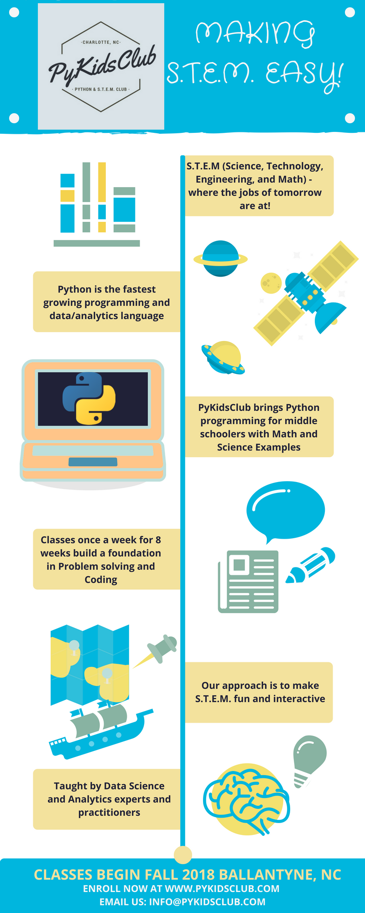

<meta name="google-site-verification" content="4fljr3mR5Ggm7Ff1z1oSIH9r6hNcfpFza0TZz-JN-as" />

### Registrations open for Fall 2018 5th-8th Graders (click the button below)

Email us for more info:
<a href="mailto:info@pykidsclub.com?Subject=Information on PyKidsClub" target="_top">Send Mail</a>

### PyKIDSClub - Program for Middle schoolers Grades 5-8

####  Why Python and S.T.E.M. (Science Technology Engineering Math)?: As the kids of today transition into the jobs of tomorrow, they will face an ever-increasing array of automation and robots doing simple tasks. If there is any doubt, see advances in Driverless Cars, Cashier-less retail stores, Alexa, and Siri. All these jobs require lots of Math, Physics, and Engineering. But above all, it will require programming machines to automate simple tasks. Python is the fastest growing programming language that is widely considered an industry standard.

#### PyKidsClub is an 8-week course designed to help Middle school students learn the basics of Python Notebooks and apply them to their Math and Science concepts. Classes meet every Wednesday starting 9/19/2018.

#### Pre-requisites: Students are expected to bring their own laptops (preferably Chromebooks) as well as have their own Google ID. An introductory email will describe required hardware and software in detail prior to the first class.

##### PyKidsClub brings leading Data Science and Analytics experts and practitioners who are passionate about helping young students in their S.T.E.M. aspirations. We make learning concepts in Math and Science fun and interactive for Middle school students. 

#### @ PyKidsClub 2018

---

[Curriculum for Fall 2018](https://github.com/pykidsclub/index/blob/master/curriculum.md)
