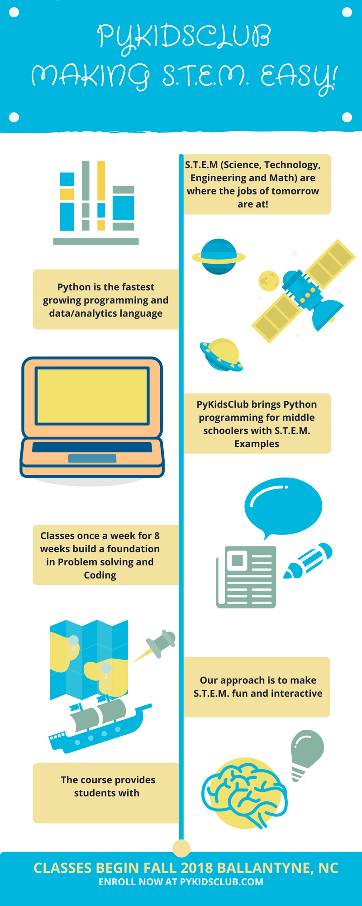

## PyKIDSClub - Program for Middle schoolers Grades 5-8

####  As the kids of today transition into the jobs of tomorrow, they will face an ever increasing array of automation and robots doing simple tasks. If there is any doubt, see advances in Driverless Cars, Cashier-less retail stores, Alexa, and Siri.

Register (click the button below)

Email us for more info:
<a href="mailto:info@pykidsclub.com?Subject=Information on PyKidsClub" target="_top">Send Mail</a>

#### All these jobs require lots of Math, Physics and Engineering. But above all, it will require programming machines to automate simple tasks. Python is the fastest programming langauge that is :

- Data Scientist
- Artificial Intelligence programmer
- Machine Learning 
- Self-driving cars
- Predictive Analytics
- Robotics Engineer
- Drone Technologist
- Automated Stock Trader

---

#### @ PyKidsClub 2018

---

[Curriculum for Fall 2018](https://github.com/pykidsclub/index/blob/master/curriculum.md)
