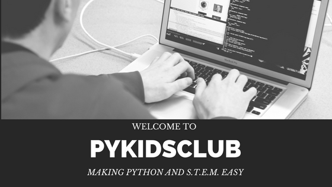

<meta name="google-site-verification" content="4fljr3mR5Ggm7Ff1z1oSIH9r6hNcfpFza0TZz-JN-as" />

## <a href="mailto:pykidsclub@gmail.com?Subject=Information on PyKidsClub" target="_top">Email Us</a> ⋅ <a href="http://pykidsclub.com/enroll">Enroll</a> ⋅ <a href="http://pykidsclub.com/about">About </a>

# **PyKidsClub** 

PyKidsClub is a 100% Student Run Organization located in Charlotte, NC. We offer online Computer Science courses designed to help students of all ages learn the basics of programming and apply them to their STEM concepts at school and careers in the future. 

## **Our Mission**

As our mission of the Computer Science courses is to enrich the knowledge and future capabilities of our local students through lectures, we also strive to enrich the future of other students worldwide. Many students in underdeveloped countries don't even have access to technology to learn. Technology is vital to learn math and science concepts of the future. We hope through donations, fundraisers, and classes, we can solve the digital divide in underdeveloped countries and fight against lack of education and technology resources. Our dream is to provide students all over the globe an equal and fair chance at becoming the creators of the future. 50% of our profits will support this cause. 

## **Why Computer Science and PyKidsClub?**
With the fast-changing digital driven world, computer science is a career path rapidly gaining popularity around the world.                              - 70% of jobs today require computer & technology skills                                                                                                 - Most C.S jobs only require a Bachelors degree
- Below is a list of high paying jobs that require CompSci:
- Front End Developer
- Software Engineer
- Data Scientist 
- Mobile Security engineer

PyKidsClub was founded by a high schooler in Charlotte with a passion for STEM, and aims to empower the next generation with essential technological skills and bridge the digital divide. 

##### @ PyKidsClub 2022

